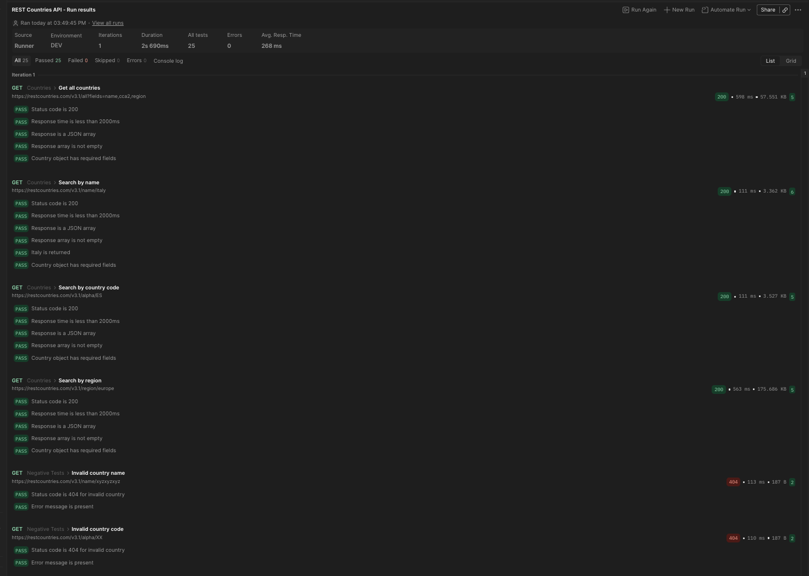

Postman QA Portfolio — REST Countries API

About this project
This collection tests the public [REST Countries API](https://restcountries.com),
covering happy path scenarios, data validation, and negative testing.

What it tests
- Retrieving all countries and validating response structure
- Searching by country name, code, and region
- Validating that correct data is returned (e.g. Italy search returns Italy)
- Negative scenarios: invalid country names and codes return 404 with error messages

Why these test cases?
I focused on:
- **Status code validation** — the most fundamental API check
- **Response time** — ensures performance is within acceptable thresholds
- **Schema validation** — confirms the API returns expected fields (name, cca2, region)
- **Business logic** — verifies the correct country is returned for a given search
- **Negative testing** — a real QA mindset means testing what should *not* work, not just happy paths

Test run results

25/25 tests passing 

How to import and run
1. Clone or download this repo
2. Open **Postman Desktop App**
3. Click **Import** and select `REST Countries API.postman_collection.json`
4. Import `DEV.postman_environment.json` and set it as active environment
5. Click **Run collection** to execute all tests

## 🛠️ Tools used
- Postman (Desktop)
- REST Countries API (free, no auth required)
